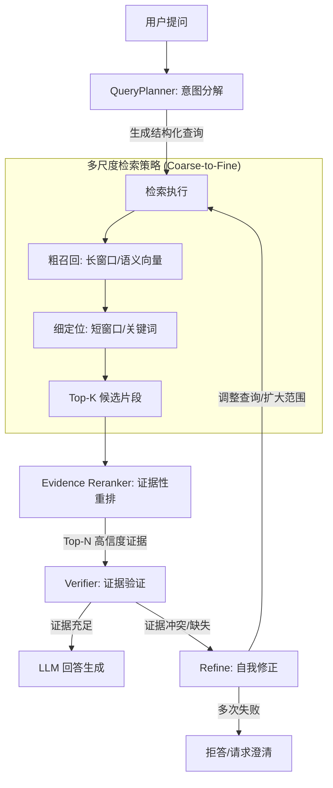

# EARS
## EARS (Evidence-Aware Reasoning System) —— 基于 MLLM 的可信音频推理与检索框架

欢迎 Star/Issue 谢谢喵~

## 1. 核心理念与架构概览
本项目旨在构建一个**闭环的音频推理系统**。我们将检索器（Retriever）从一个静态的查表工具，升级为一个**动态的代理（Agent）**。系统不仅要“听见”音频，还要“理解”音频作为证据的效力。

### 整体架构流程图（逻辑层）


---

## 2. 关键模块技术设计

### 模块一：QueryPlanner (基于推理链的查询规划)
**痛点解决**：用户的问题往往是宏观的（如“昨天的会议里，产品经理对这功能态度如何？”），直接搜很难搜到。
**技术方案**：
*   **Prompt Engineering**：让 LLM 输出 JSON 格式的检索计划。
*   **多维解构**：
    *   **语义查询**：`vector_query: "产品经理 抱怨 功能"`
    *   **元数据过滤**：`speaker: "Product_Manager"`, `time_range: "2023-10-24"`
    *   **非语言线索**：`audio_event: "Sigh" (叹气)` 或 `tone: "Angry"` (需要音频编码器支持)

### 模块二：Multi-Scale Retriever (多尺度金字塔检索)
**痛点解决**：解决“切片太短无语境，切片太长稀释语义”的矛盾。
**技术方案**：
*   **双层索引结构**：
    *   **L1 (语义层)**：60s 窗口，使用 CLAP 或 Whisper Encoder 提取 Embedding。用于定位“大致时间段”。
    *   **L2 (细节层)**：5s-10s 窗口，包含详细 ASR 转录和细粒度音频特征。
*   **检索逻辑**：先在 L1 找到 Top-10 区域，展开这些区域的 L2 切片，进行精确匹配。
*   **上下文融合**：命中 L2 切片后，自动向前后扩展 5秒，形成一个完整的 Evidence Unit。

### 模块三：Evidence Reranker (从“相似度”到“证据性”)
**痛点解决**：Top-K 看起来很像（关键词重合），但其实没包含答案。
**技术方案**：
*   **Cross-Encoder 重排模型**：不仅仅计算 `CosineSimilarity(Query, Audio)`，而是训练一个轻量级分类器输入 `(Question, Audio_Transcript)`，输出 `Score: 该片段包含答案的概率`。
*   **结构化输出**：将音频转化为结构化证据包（Evidence Pack）：
    ```json
    {
      "timestamp": "04:12-04:25",
      "transcript": "虽然这很难，但考虑到成本，我们必须砍掉这个功能。",
      "audio_tags": ["speech", "serious_tone"],
      "relevance_score": 0.92
    }
    ```

### 模块四：Verifier & Refiner (闭环控制与自我修正)
**痛点解决**：防止 LLM 强行回答（幻觉），实现“失败感知”。

---

## 3. 多模态增强策略 (Multimodal RAG)

音频往往存在“听不清”或“指代不明”的问题，我们需要引入**视觉（Video）**或**文本上下文**作为辅助。

1.  **视觉消歧**：
    *   当音频检索到“巨大的响声”时，检索同一时间戳的视频帧。LLM 通过视觉描述（Visual Captioning）判断是“关门声”还是“掉落声”，从而修正推理。
2.  **跨模态一致性校验**：
    *   Verifier 不仅检查音频证据，还检查视频画面是否支持该音频结论。如果音频说“我把文件放桌上了”，但视频里手里没文件，系统应标注“可疑证据”。

---

## 4. 如何评估“真的更好用”？

除了常规的 Recall@K，我们引入以下指标：

1.  **Evidence Support Score (ESS)**：人工或 GPT-4 打分。
    *   检索到的片段是否包含了回答问题所需的*充分且必要*条件？（0-10分）
2.  **Reasoning Hallucination Rate (RHR)**：
    *   统计回答中包含的“事实陈述”有多少比例无法被检索到的音频片段支撑。
3.  **Refusal Precision**：
    *   在故意给出的无法回答的问题（Unanswerable Questions）集合上，系统能否正确输出“无法回答”，而不是编造答案。
4.  **Time-to-Evidence**：
    *   定位到关键证据的时间戳误差（是否精确到了秒级，而不是只给了个 5 分钟的文件）。
